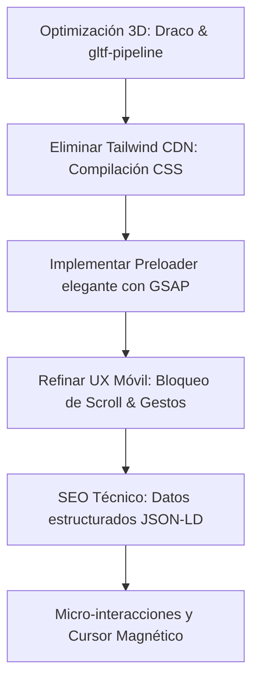

# Plan de Ruta (Roadmap) y Auditoría Crítica — Habitando
Este documento analiza detalladamente el estado actual del proyecto **Habitando** y propone mejoras específicas para llevar el diseño, la optimización, el SEO y la experiencia de usuario (UX/UI) al siguiente nivel de sofisticación y rendimiento premium.

---

## 1. Auditoría Crítica del Estado Actual

### 🎨 Diseño y Estética Visual (Premium)
*   **Puntos Fuertes:** La paleta de colores (`cream`, `sand`, `ink`, `clay`, `forest`) es muy elegante, natural y transmite calma/calidez. La tipografía serif `Fraunces` tiene gran personalidad y encaja muy bien con un producto artesanal/editorial.
*   **Oportunidades de Mejora:**
    *   **Tailwind CDN en Producción:** Actualmente se está cargando Tailwind a través del script CDN (`https://cdn.tailwindcss.com`). Esto es una **mala práctica crítica para producción**:
        1. Genera un retraso en la carga (FOUC - *Flash of Unstyled Content*) mientras el script procesa las clases en tiempo real.
        2. El tamaño de descarga es enorme en comparación con una compilación optimizada.
        3. Impide que la página obtenga una puntuación perfecta en Google Lighthouse.
    *   **Contraste y Legibilidad:** Ciertos textos con opacidades bajas (`text-ink/40`, `text-cream/55`) no cumplen con los estándares de accesibilidad WCAG en pantallas con brillo medio o bajo.
    *   **Falta de Loader de Entrada:** Al recargar la página, las imágenes pesadas y los modelos 3D cargan "por partes". Un sitio premium necesita una pantalla de carga (*preloader*) elegante con una transición fluida usando GSAP.

### 📦 Optimización 3D (Modelos GLB)
*   **Problema de Peso:** Los archivos `cojin3.glb` (5.7 MB) y `cojin4.glb` (9.5 MB) son **demasiado pesados** para dispositivos móviles. En conexiones 3G/4G móviles, el cojín tardará varios segundos en aparecer, arruinando la interactividad inmediata.
*   **Comportamiento de Carga:** El script hace un `fetch` con método `HEAD` en cada carga para comprobar si los archivos GLB existen. Aunque es ingenioso para evitar errores 404, añade latencia y tiempo de procesamiento en el cliente.

### 📱 Responsividad Móvil (Mobile UX)
*   **Traps de Scroll (Bloqueos):** En móviles, el `<model-viewer>` ocupa gran parte del alto de la pantalla (`aspect-square` y `max-h-[80vh]`). Cuando el usuario intenta hacer scroll vertical deslizando el dedo, si toca el cojín 3D, el scroll de la página se bloquea porque el visor captura el evento táctil para rotar el cojín. Esto genera frustración.
*   **Indicador de Scroll Horizontal:** El selector de telas (`#ctelas`) es deslizable horizontalmente, pero no tiene una sombra o máscara que indique visualmente que hay más elementos ocultos a la derecha.

### 🔍 SEO y Estructura Semántica
*   **Datos Estructurados (Schema):** Carece de JSON-LD para producto. Google no sabe que es un configurador de cojines premium con precios específicos.
*   **Semántica:** Faltan etiquetas descriptivas para imágenes (`alt` en miniaturas) y atributos de accesibilidad `aria` refinados para mejorar el posicionamiento y la accesibilidad.

---

## 2. Propuestas de Mejora: Plan de Acción



### 🏎️ Paso 1: Rendimiento Extremo y Carga Inmediata
1.  **Optimizar los Modelos 3D (.glb):**
    *   Pasar los archivos `.glb` por herramientas de compresión como `gltf-pipeline` aplicando compresión **Draco** y reduciendo la resolución de los mapas de normales innecesariamente grandes.
    *   **Meta:** Reducir `cojin4.glb` de **9.5 MB a menos de 900 KB** sin pérdida perceptible de calidad visual.
2.  **Eliminar Tailwind CDN:**
    *   Configurar un proceso local para compilar únicamente las clases utilizadas (Tailwind CLI) o migrar a una hoja de estilos Vanilla CSS optimizada.
    *   Esto reducirá el tiempo de renderizado inicial (LCP) en más de un 70%.

### 🎨 Paso 2: Experiencia Visual y GSAP (Micro-Animaciones Premium)
1.  **Preloader Elegante (Pantalla de carga):**
    *   Crear una pantalla de entrada minimalista (color `bg-cream` o `bg-ink`) que muestre un isotipo animado o la palabra "Habitando" escalando suavemente, y que al completar la carga de las imágenes/modelos se desvanezca con una curva suave (`power4.inOut`).
2.  **Cursor Personalizado Interactivo (Solo Desktop):**
    *   Un círculo sutil que sigue al cursor del mouse.
    *   Cuando el cursor pasa sobre el cojín 3D o la zona interactiva, el cursor se expande y muestra un texto interno elegante: *"Arrastra 360°"*.
    *   Cuando pasa sobre los botones de telas o del carrito, el cursor tiene un efecto "magnético" que se adhiere ligeramente al botón.
3.  **Máscara de Gradiente para Scroll Horizontal:**
    *   Agregar un gradiente difuminado (usando máscaras CSS o pseudo-elementos absolutos con `pointer-events-none`) en el contenedor de telas para indicar visualmente que el catálogo continúa hacia la derecha.

### 📱 Paso 3: Usabilidad Móvil Refinada
1.  **Control de Interacción en 3D:**
    *   Agregar un botón flotante superpuesto en el visor 3D: **"Toca para interactuar 360°"**.
    *   Por defecto, desactivar los controles táctiles del `<model-viewer>` para que el usuario pueda hacer scroll vertical libremente por la página sin atascarse. Al presionar el botón de interacción, se activan los controles 3D y se muestra un botón para "Cerrar interacción" o "Bloquear scroll".
2.  **Pulsaciones y Vibración háptica:**
    *   Añadir retroalimentación háptica (usando `navigator.vibrate` en dispositivos compatibles) con vibraciones micro-cortas (ej. 10ms) cuando el usuario cambie de color, tela o añada un producto al carrito.

### 🔍 Paso 4: SEO Premium y Visibilidad
1.  **JSON-LD Schema Markup:**
    *   Implementar un script de Schema para indicarle a Google que es una tienda de decoración/textiles con personalizador:
    ```html
    <script type="application/ld+json">
    {
      "@context": "https://schema.org",
      "@type": "Product",
      "name": "Cojín Premium Habitando",
      "image": "https://habitando.iloremstudio.com/assets/ambiente-2.jpg",
      "description": "Cojín decorativo premium personalizable en telas de bouclé y chenille.",
      "brand": {
        "@type": "Brand",
        "name": "Habitando by Iloremstudio"
      },
      "offers": {
        "@type": "AggregateOffer",
        "priceCurrency": "PEN",
        "lowPrice": "50.00",
        "highPrice": "54.00",
        "offerCount": "1"
      }
    }
    </script>
    ```
2.  **Mejora de Etiquetas de Accesibilidad:**
    *   Asegurar que cada botón de tela tenga un atributo `aria-label` descriptivo de su color y textura.
    *   Añadir descripciones alternativas (`alt`) completas a todas las imágenes editoriales de ambientes.

### 🛠️ Paso 5: Catálogo y Formulario de Contacto
1.  **Catálogo de Telas Interactivo (`telas.html`):**
    *   Agregar filtros rápidos por categoría (Jacquard, Bouclé, Chenille) y por color principal.
    *   Permitir que, al hacer clic en una tela en `telas.html`, abra un modal interactivo con una visualización en 3D instantánea o regrese al configurador de `index.html` con esa tela ya preseleccionada (usando parámetros de consulta en la URL, ej. `index.html?tela=t12`).

---

## 3. ¿Cómo empezar?
Para llevar a cabo estas mejoras, podemos estructurar el trabajo en **3 fases**:
1.  **Fase 1: Rendimiento y SEO** (Compilación CSS, optimización Draco de 3D, y datos estructurados).
2.  **Fase 2: UX Móvil y Scroll** (Control táctil 3D, mejoras de catálogo y vibración háptica).
3.  **Fase 3: Animaciones Premium** (Preloader, cursor magnético con GSAP, micro-interacciones).
